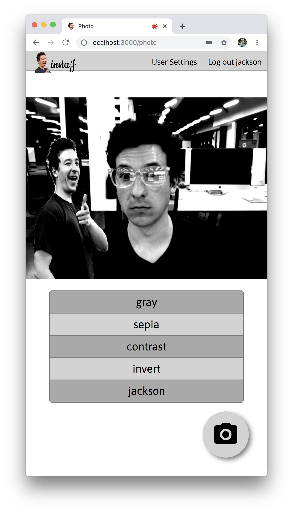
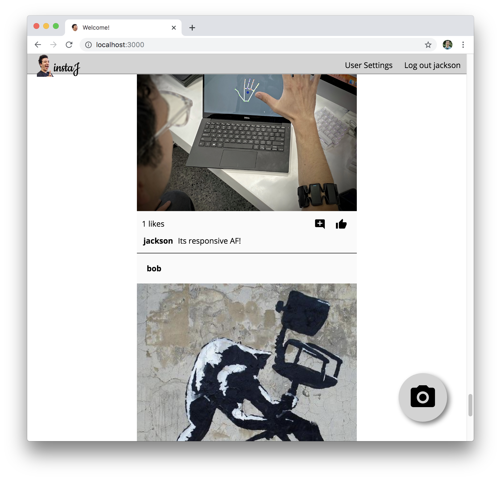

# InstaJ
This is a simple photosharing application build with Node/express, sqlite and react.
Photo capture and drag and drop functionality is supported.
It was constructed to provide all the basic functionality one would expect of such an application.

## Run
`npm install`
`npm start`

If the sqlite db file is not found it will be created and prepopulated with some data in `migrate.js`
If a db file is found it will be used and not overwritten.

The default server port is 3000 and is configurable from the index file.

## Screens

	
	

